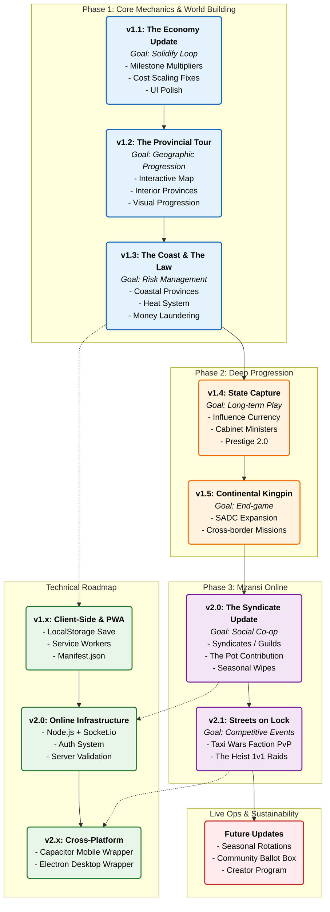

# Mzansi Crime Idle: Visual Development Roadmap

This flowchart visualizes the planned updates, technical milestones, and future live-ops strategies for Mzansi Crime Idle.

```mermaid
graph TD
    %% Styling
    classDef phase1 fill:#e3f2fd,stroke:#1565c0,stroke-width:2px,color:#000;
    classDef phase2 fill:#fff3e0,stroke:#ef6c00,stroke-width:2px,color:#000;
    classDef phase3 fill:#f3e5f5,stroke:#7b1fa2,stroke-width:2px,color:#000;
    classDef tech fill:#e8f5e9,stroke:#2e7d32,stroke-width:2px,color:#000;
    classDef future fill:#ffebee,stroke:#c62828,stroke-width:2px,color:#000;

    subgraph P1 [Phase 1: Core Mechanics & World Building]
        direction TB
        v1.1(<b>v1.1: The Economy Update</b><br/><i>Goal: Solidify Loop</i><br/>- Milestone Multipliers<br/>- Cost Scaling Fixes<br/>- UI Polish):::phase1
        v1.2(<b>v1.2: The Provincial Tour</b><br/><i>Goal: Geographic Progression</i><br/>- Interactive Map<br/>- Interior Provinces<br/>- Visual Progression):::phase1
        v1.3(<b>v1.3: The Coast & The Law</b><br/><i>Goal: Risk Management</i><br/>- Coastal Provinces<br/>- Heat System<br/>- Money Laundering):::phase1
        
        v1.1 --> v1.2 --> v1.3
    end

    subgraph P2 [Phase 2: Deep Progression]
        direction TB
        v1.4(<b>v1.4: State Capture</b><br/><i>Goal: Long-term Play</i><br/>- Influence Currency<br/>- Cabinet Ministers<br/>- Prestige 2.0):::phase2
        v1.5(<b>v1.5: Continental Kingpin</b><br/><i>Goal: End-game</i><br/>- SADC Expansion<br/>- Cross-border Missions):::phase2
        
        v1.4 --> v1.5
    end

    subgraph P3 [Phase 3: Mzansi Online]
        direction TB
        v2.0(<b>v2.0: The Syndicate Update</b><br/><i>Goal: Social Co-op</i><br/>- Syndicates / Guilds<br/>- The Pot Contribution<br/>- Seasonal Wipes):::phase3
        v2.1(<b>v2.1: Streets on Lock</b><br/><i>Goal: Competitive Events</i><br/>- Taxi Wars Faction PvP<br/>- The Heist 1v1 Raids):::phase3
        
        v2.0 --> v2.1
    end

    subgraph Tech [Technical Roadmap]
        direction TB
        T1(<b>v1.x: Client-Side & PWA</b><br/>- LocalStorage Save<br/>- Service Workers<br/>- Manifest.json):::tech
        T2(<b>v2.0: Online Infrastructure</b><br/>- Node.js + Socket.io<br/>- Auth System<br/>- Server Validation):::tech
        T3(<b>v2.x: Cross-Platform</b><br/>- Capacitor Mobile Wrapper<br/>- Electron Desktop Wrapper):::tech
        
        T1 --> T2 --> T3
    end

    subgraph Future [Live Ops & Sustainability]
        LO(<b>Future Updates</b><br/>- Seasonal Rotations<br/>- Community Ballot Box<br/>- Creator Program):::future
    end

    %% Connections between phases
    v1.3 --> v1.4
    v1.5 --> v2.0
    v2.1 --> LO

    %% Tech dependencies (approximate alignment)
    v1.3 -.-> T1
    v2.0 -.-> T2
    v2.1 -.-> T3
```